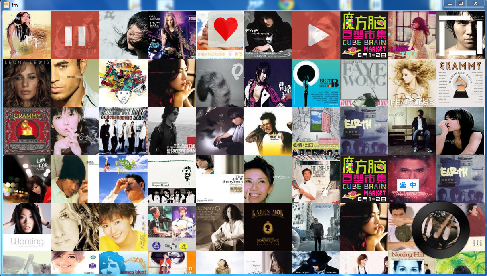
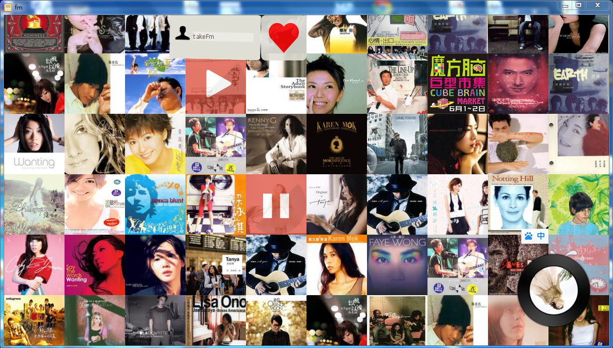

node-webkit-doubanfm
====================

豆瓣是一个会让人慢慢喜欢的地方~
---

机遇node-webkit制作的左面客户端.结合豆瓣页面爬虫分析,实现音乐与评论匹配.嗯,听音乐的时候看文字是一件幸福安静的事.

**功能:**

1. 兆赫推荐歌曲
2. 自动加载
3. 自动播放
4. 加红心
5. 加载红心歌曲

点击nw.exe即可运行node-webkit客户端

应有同学的想法,已经压缩了一个**[exe文件](http://pan.baidu.com/s/1o60mlIy)**node-webkit的,打开就可以听啦~

欢迎大家在issue上提修改意见.或者邮箱cquptzw[at]google.com联系~

